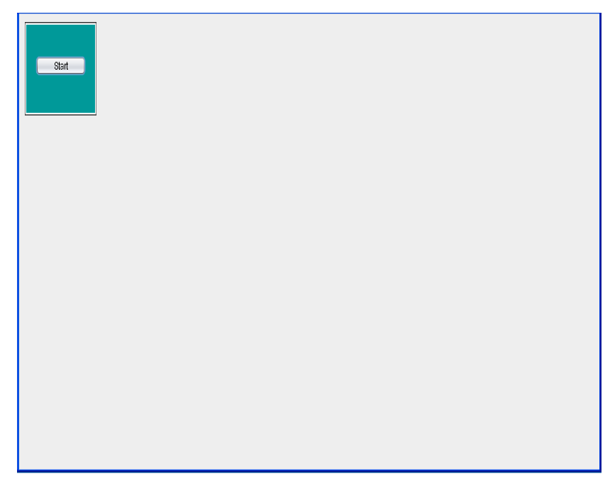
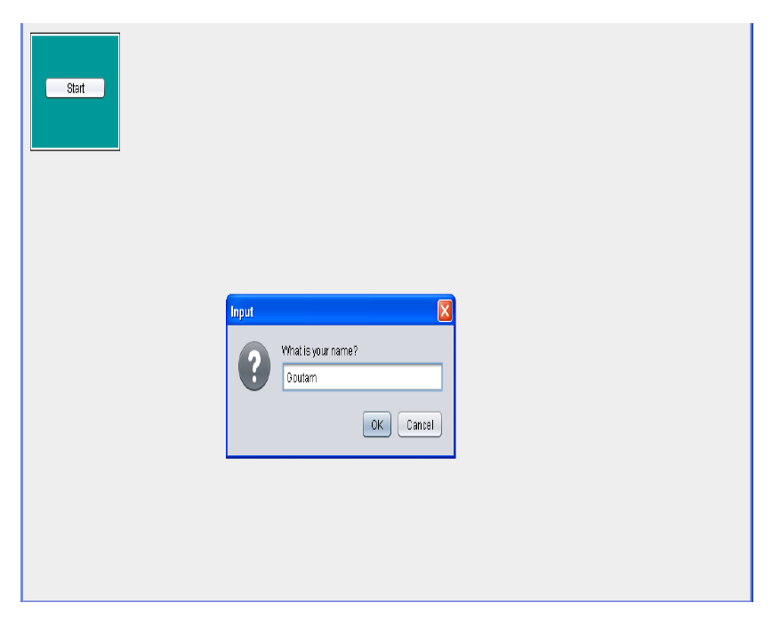
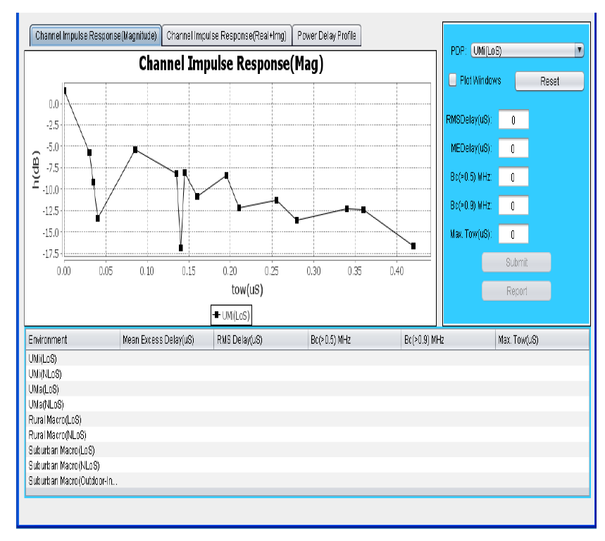
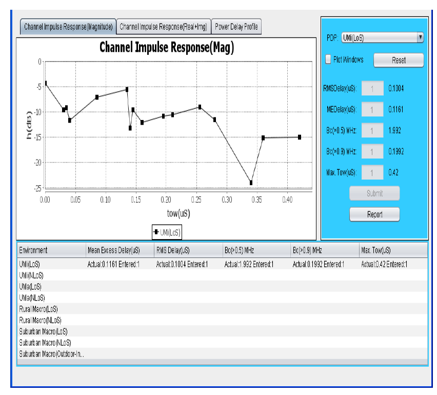
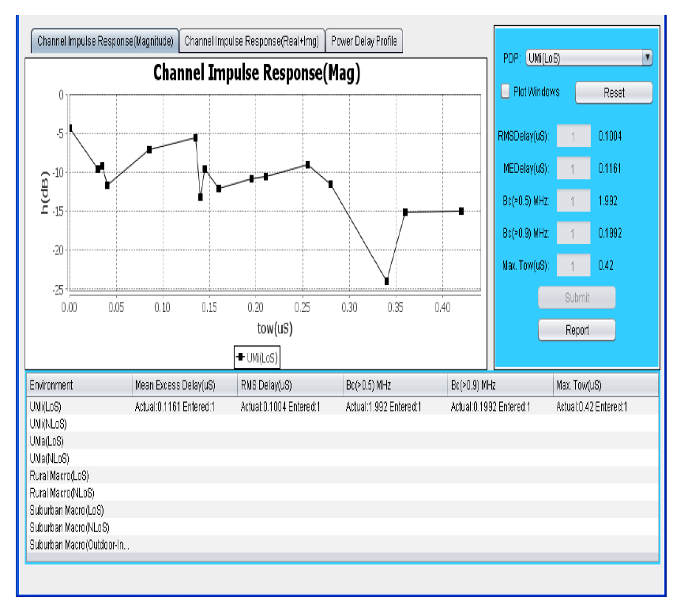
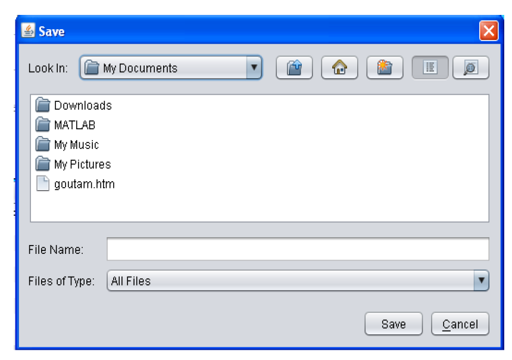
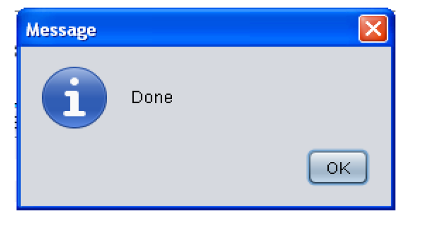
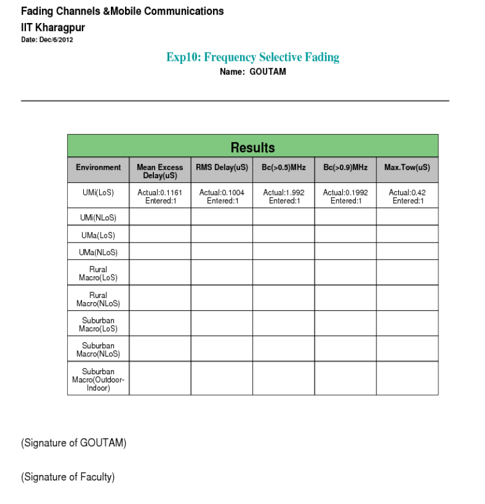

## Procedure

Follow the instructions given below to perform the experiments:-

* Step1:- Click on the button START. A page appears with a dialogue box asking for your name.

   

      
      

* Step 2:- Enter your name then Click Ok.

    

      
      

  

      
      

* Step3:- Click on "RESET" button and enter the values of the parameter given here,then click on the "SUBMIT' button.

   

      
      

* step4:- To generate the Pdf report click on the "REPORT' button.

   

      
      

* step5:- Enter your file name then Click on the "Save" button.

   

      
      

* Step6:- After generation of the Report you will get following message.

   

      
      

* Step7:-Click on the "Ok" and you will get your Report.

   

      
      

* Step8:- To Redo the experiment click on "RESET" button.
* 
    
