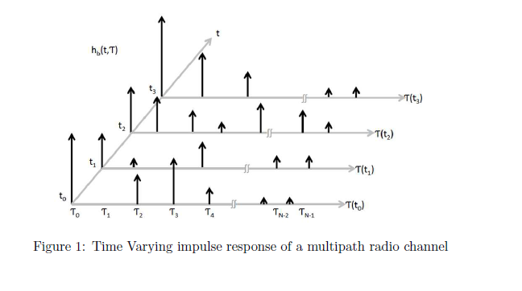
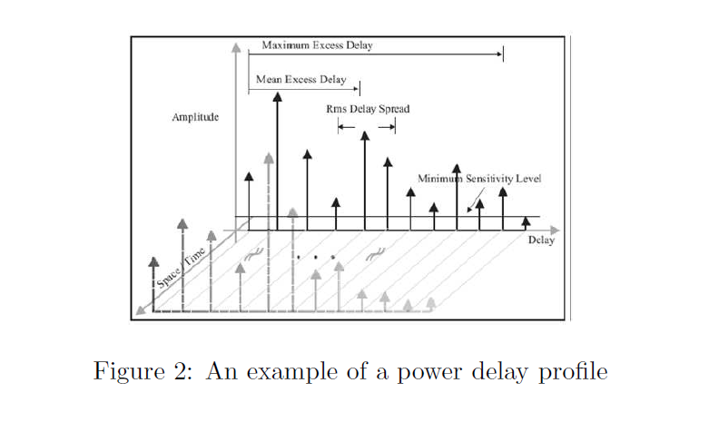
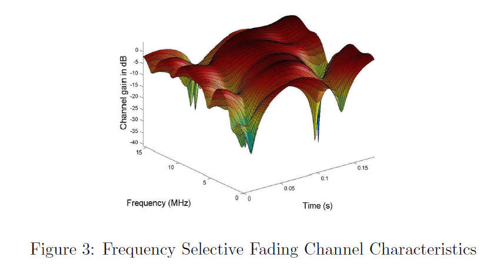
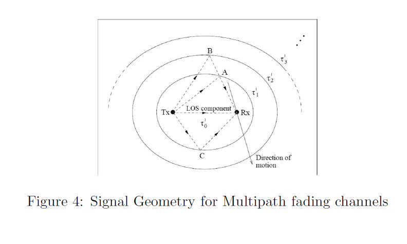

## Theory
**Introduction:**  
In an urban environment, a Line of Sight (LOS) propagation path may or may not exist between the Base Station (BS) and the Mobile Station (MS) because the mobile antennas are well below the height of the surrounding structures. The radio waves transmitted from the BS arrive at the MS after reflection, diffraction, and scattering from natural and man-made objects. These incoming radio waves, arriving from different directions, have different propagation delays. These multipath components, with randomly distributed amplitudes, phases, and angles of arrival, combine vectorially at the receiver antenna, causing the received signal to distort or fade. Thus, fading is the rapid fluctuation in the amplitude, phase, and multipath delays of a radio signal over a short period, so large-scale path loss effects can be neglected. Even when the MS is stationary, fading is caused by the movement of the surrounding objects. The changes in the environment or the motion of the MS result in spatial variations of amplitudes and phases, which manifest as temporal variations. The mobile radio channel can be modeled as a linear filter with a time-varying impulse response $h(t, \tau)$. The filtering nature of the channel is caused by the summation of amplitudes and delays of multiple arriving waves at the same instant.

      
      

Fig.1 shows different snapshots of $h(t, \tau)$, where $t$ varies into the page and the multipath delay axis is quantized into excess delay bins of width $\Delta t$. Excess delay is the relative delay of the i-th multipath component compared to the first arriving component and is denoted by $i$. The first arriving multipath component has an excess time delay $\tau_0=0$. The propagation delay between the transmitter and the receiver for the i-th path is $\tau_i = i\Delta t$. Any number of multipath signals received within the i-th bin is represented by a single resolvable multipath component having the delay $i$. The maximum excess delay of the channel is given by $N$, where $N$ is the total number of multipath components. The baseband impulse response of a multipath channel can be expressed as the vector sum of a series of delayed, phase-shifted replicas of the transmitted signal. Hence,

$$h(t,\tau) = \sum_{i=0}^{N-1} a_i(t,\tau) \exp[j(\theta_i)(t,\tau)] \delta(t-\tau_i(t))$$

where $a_i(t,\tau)$, $\tau_i(t)$, and $\theta_i(t,\tau)$ are the real amplitudes, excess delays, and phase shifts of a single multipath component within the $i^{th}$ excess delay bin. It is interesting to note that depending on the choice of $\Delta t$ and the physical channel delay properties, there may be two or more multipath components arriving within the same excess delay bin. These components combine vectorially to yield the instantaneous amplitude and phase of the corresponding multipath component. As a result, the amplitude of the multipath component within an excess delay bin may fade over the local area.

**Power Delay Profile:** For small-scale channel modeling, the *power delay profile* gives the average power at the channel output as a function of the time delay $\tau$. It is obtained by taking the spatial average of $|h(t,\tau)|^2$ over a local area. By making several local area measurements of $|h(t,\tau)|^2$ in different locations, it is possible to build an ensemble of power delay profiles, each representing a possible small-scale multipath channel state.

The power delay profile at time $t_0$ for a probing pulse $p(t)$ at the channel input is given by

$$P(\tau_0) = |r|^2 = \sum_{k=0}^{N-1} a_k^2(t_0)$$

Several small-scale multipath channel parameters, such as mean excess delay, rms delay spread, and excess delay spread, which define the channel's time dispersive properties, can be obtained from the power delay profile.

**Mean Excess Delay:** Mean Excess Delay is the first moment of the power delay profile and is defined as

$$\bar{\tau} = \frac{\sum_k a_k^2 \tau_k}{\sum_k a_k^2} = \frac{\sum_k P(\tau_k)\tau_k}{\sum_k P(\tau_k)}$$

**Root Mean Square Delay:** The rms delay spread is the square root of the second central moment of the power delay profile and is defined as

$$\sigma_{\tau} = \sqrt{\bar{\tau^2} - (\bar{\tau})^2}$$

where

$$\bar{\tau^2} = \frac{\sum_k a_k^2 \tau_k^2}{\sum_k a_k^2} = \frac{\sum_k P(\tau_k)\tau_k^2}{\sum_k P(\tau_k)}$$

These delays are measured relative to the first detectable signal arriving at the receiver at $\tau_0 = 0$. It is also important to note that rms delay spread and mean excess delay are defined from a single power delay profile, which is the temporal or spatial average of consecutive impulse response measurements collected and averaged over a local area.

**Maximum Excess Delay:** The *maximum excess delay* of the power delay profile is defined as the time delay during which the multipath energy falls to X dB below the maximum. It is defined as $\tau_x - \tau_0$, where $\tau_0$ is the first arriving signal and $\tau_x$ is the maximum delay at which a multipath component is within X dB of the strongest multipath signal.

Fig.2 illustrates the computation of the time dispersive parameters of the multipath channel.

      
      

**Coherence Bandwidth:** The delay spread parameters are used to characterize the channel in the time domain. In the frequency domain, the channel is characterized by the coherence bandwidth, $B_c$, which is the range of frequencies over which the signal strength remains more or less unchanged. This implies that two sinusoids with frequency separation greater than $B_c$ are affected quite differently by the channel.

If the coherence bandwidth is defined as the bandwidth over which the frequency correlation function is above 0.9, then it can be mathematically obtained as

$$B_c \approx \frac{1}{50\sigma_\tau}$$

The coherence bandwidth for frequency correlation above 0.5 is given by

$$B_c \approx \frac{1}{5\sigma_\tau}$$

**Frequency Selective Fading:** The type of fading experienced by a signal propagating through a mobile radio channel depends on the nature of the transmitted signal with respect to the characteristics of the channel. If the transmitted signal has a bandwidth greater than the bandwidth over which the frequency response of a wireless channel has a constant gain and linear phase, then it undergoes frequency selective fading. In such cases, the multipath delay spread is greater than the symbol interval. Consequently, the received signal contains multiple versions of the transmitted waveform which are attenuated and delayed in time, and hence the received signal is distorted. Thus, frequency selective fading is a result of the time dispersion of the transmitted symbol within the channel. The symbol gets spread out in time, resulting in Intersymbol Interference (ISI). In the frequency domain, it is observed that different components have different gains. Fig.3 illustrates the characteristics of a frequency selective fading channel.

      
      

For frequency selective fading, the spectrum $S(f)$ of the transmitted signal has a bandwidth greater than the coherence bandwidth $B_c$ of the channel. Frequency Selective Fading channels are also called wideband channels since the symbol bandwidth is greater than the coherence bandwidth.

Thus, a channel undergoes frequency selective fading if

$$B_s > B_c$$

and

$$T_s < \sigma_\tau$$

The path geometry for a multipath fading channel is given in Fig.4. Considering only single reflections, all scatterers associated with a particular path length are located on an ellipse with the transmitter and the receiver located at the foci. Different delays correspond to different confocal ellipses.

Frequency selective channels have strong scatterers located on several ellipses that correspond to differential delays that are significant compared to the symbol duration. In urban and suburban macro-cellular systems, these strong scatterers usually correspond to high-rise buildings or perhaps large distant terrain features such as mountains.

The article is based on [1], [2], [3].

      
      

     
 
